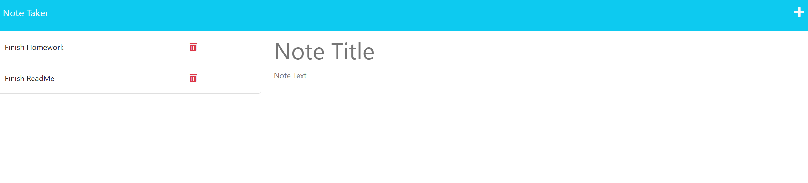

# Note Taker Starter Code# Note-Taker

## Description

My motivation was to create a note-taker application where I am able to write and save notes so that I can organize my thoughts and be more efficient. I wanted to test my skills with Express and deploy to Heroku. I had problems initially getting the post request to go through but was able to figure it out through express documentation. 

## Table of Contents (Optional)

- [Installation](#installation)
- [Usage](#usage)
- [Credits](#credits)

## Installation

When starting the application in VS Code npm i will need to be ran to install the necessary packages. To run through the terminal, node server.js will need to be ran and then you can open the link. Or you can go to the deployed site. 

## Usage

To use, click get the button "Get started." It will take you to the note taker html page. Here you can add a note title and note text. You can click the save icon and the notes will be displayed on the left. If you'd like to delete the note, you can do this my clicking the trashcan button. 

## Credits
Thank you to my DU boot camp coding professor and TAs as well as fellow class mates. 

I needed help creating the server. 
https://www.geeksforgeeks.org/how-to-build-a-simple-web-server-with-node-js/

I used boot camp class notes. 